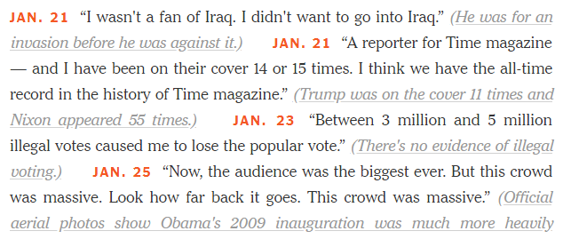
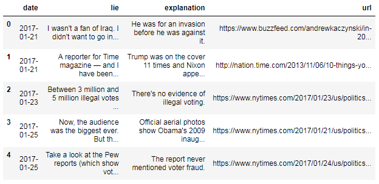

# Web scraping the President's lies in 16 lines of Python

This repository contains the [Jupyter notebook](trump_lies.ipynb) and [dataset](trump_lies.csv) and we'll scrape data from a static web page using the **requests** and **Beautiful Soup** libraries, and export that data into a structured text file using the **pandas** library.

## Motivation

On July 21, 2017, the New York Times updated an opinion article called [Trump's Lies](https://www.nytimes.com/interactive/2017/06/23/opinion/trumps-lies.html), detailing every public lie the President has told since taking office. Because this is a newspaper, the information was (of course) published as a block of text:

<p align="center"><a href="https://www.nytimes.com/interactive/2017/06/23/opinion/trumps-lies.html" title="Read the New York Times article" target="_blank"></a></p>

This is a great format for human consumption, but it can't easily be understood by a computer.But we'll extract the President's lies from the New York Times article and store them in a structured [dataset](trump_lies.csv).

<p align="center"><a href="trump_lies.csv" title="Open the dataset of President Trump's lies"></a></p>

## Outline 

- Reading the web page into Python
- Parsing the HTML using Beautiful Soup
    - Collecting all of the records
    - Extracting the date
    - Extracting the lie
    - Extracting the explanation
    - Extracting the URL
    - Recap: Beautiful Soup methods and attributes
- Building the dataset
    - Applying a tabular data structure
    - Exporting the dataset to a CSV file
- Summary: 16 lines of Python code

## 16 lines of Python code

Just want to see the code? Here it is:

```python
import requests  
r = requests.get('https://www.nytimes.com/interactive/2017/06/23/opinion/trumps-lies.html')

from bs4 import BeautifulSoup  
soup = BeautifulSoup(r.text, 'html.parser')  
results = soup.find_all('span', attrs={'class':'short-desc'})

records = []  
for result in results:  
    date = result.find('strong').text[0:-1] + ', 2017'
    lie = result.contents[1][1:-2]
    explanation = result.find('a').text[1:-1]
    url = result.find('a')['href']
    records.append((date, lie, explanation, url))

import pandas as pd  
df = pd.DataFrame(records, columns=['date', 'lie', 'explanation', 'url'])  
df['date'] = pd.to_datetime(df['date'])  
df.to_csv('trump_lies.csv', index=False, encoding='utf-8') 
```


